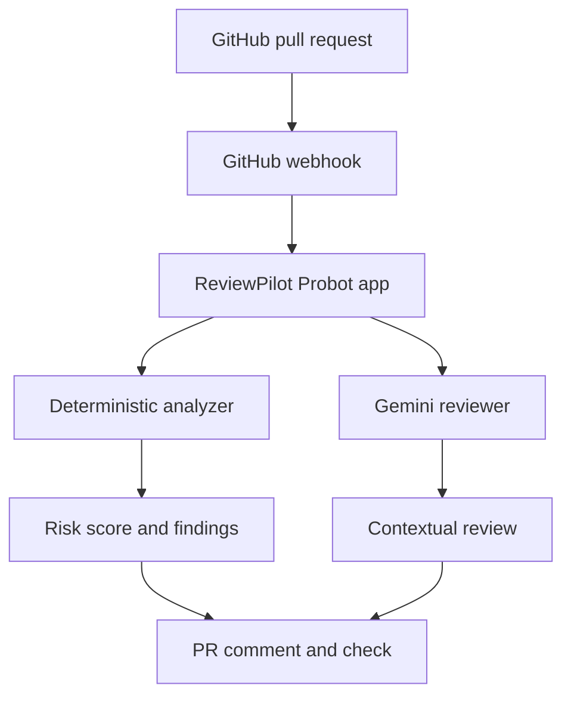

# ReviewPilot AI

[](https://github.com/saxenap2804/ReviewPilot-AI/actions)
[](https://github.com/saxenap2804/ReviewPilot-AI/actions/workflows/docker-publish.yml)
[](https://nodejs.org/)
[](https://www.typescriptlang.org/)
[](https://www.docker.com/)
[](LICENSE)

ReviewPilot AI is an intelligent GitHub App that automatically reviews pull requests using deterministic security rules and Gemini-powered contextual analysis.

It examines changed code, detects risky patterns, calculates a risk score, recommends tests, posts a structured PR review, and publishes a GitHub status check that can flag high-risk changes before they are merged.

## Features

- Automatically reviews newly opened, reopened, and updated pull requests
- Retrieves changed files and code patches using the GitHub API
- Detects risky patterns using deterministic static-analysis rules
- Generates contextual code-review summaries using Google Gemini
- Calculates a transparent risk score from `0–100`
- Recommends tests based on the submitted changes
- Creates GitHub status checks for pull-request quality gates
- Updates its existing PR comment instead of creating duplicates
- Continues with deterministic analysis when Gemini is unavailable
- Includes automated unit tests and GitHub Actions CI
- Builds and publishes a multi-stage Docker image to GHCR
- Keeps credentials out of Git and Docker images

## Example Review

ReviewPilot posts a structured comment directly on the pull request:

```text
🤖 ReviewPilot Automated Review

Risk score: 60/100

Change summary
- Files changed: 1
- Additions: 5
- Deletions: 0

Deterministic findings
🔴 HIGH — Avoid eval(); it can execute untrusted code.
🔴 HIGH — Possible hardcoded credential detected.

AI review
- Summary of the change
- Key security and reliability risks
- Recommended tests
```

It also publishes a `ReviewPilot AI` check:

| Risk score | Conclusion | Meaning |
|---:|---|---|
| `0–29` | Success | No significant deterministic risks detected |
| `30–59` | Neutral | Manual review is recommended |
| `60–100` | Failure | High-risk changes were detected |

## Architecture



## Review Pipeline

1. GitHub sends a pull-request webhook.
2. Probot authenticates as the installed GitHub App.
3. ReviewPilot retrieves all changed files through the GitHub API.
4. The deterministic analyzer inspects newly added lines.
5. Gemini analyzes the PR title, description, and code changes.
6. ReviewPilot combines deterministic and AI-generated feedback.
7. The app creates or updates one persistent PR comment.
8. A GitHub check is published using the calculated risk score.

## Deterministic Rules

| Pattern | Severity | Risk points |
|---|---|---:|
| Use of `eval()` | High | 30 |
| Possible hardcoded credential | High | 30 |
| Empty `catch` block | Medium | 15 |
| Debug `console.log()` | Low | 5 |
| Unresolved `TODO` | Low | 5 |

The final score is capped at `100`.

Only newly added lines from the pull-request patch are analyzed, helping reduce false positives from existing code.

## Technology Stack

- Node.js 22
- TypeScript
- Probot
- GitHub Apps API
- GitHub Checks API
- Google Gemini
- Node test runner
- Docker
- GitHub Actions
- GitHub Container Registry
- Smee.io for local webhook forwarding

## Project Structure

```text
ReviewPilot-AI/
├── .github/
│   └── workflows/
│       ├── ci.yml
│       └── docker-publish.yml
├── src/
│   ├── index.ts
│   ├── analyzer.ts
│   └── ai-reviewer.ts
├── tests/
│   └── analyzer.test.ts
├── .dockerignore
├── .env.example
├── .gitignore
├── Dockerfile
├── package.json
├── package-lock.json
├── tsconfig.json
└── README.md
```

## Prerequisites

Before running ReviewPilot locally, install:

- Node.js 22 or newer
- npm
- Git
- Docker Desktop, if testing the container
- A GitHub account
- A Google Gemini API key

## Local Installation

Clone the repository:

```bash
git clone https://github.com/saxenap2804/ReviewPilot-AI.git
cd ReviewPilot-AI
```

Install dependencies:

```bash
npm ci
```

Build the TypeScript application:

```bash
npm run build
```

Run the tests:

```bash
npm test
```

## GitHub App Configuration

Create a GitHub App from:

```text
GitHub Settings → Developer settings → GitHub Apps
```

Configure these repository permissions:

| Permission | Access |
|---|---|
| Contents | Read-only |
| Issues | Read and write |
| Pull requests | Read and write |
| Checks | Read and write |
| Metadata | Read-only |

Subscribe to:

```text
Pull request
```

For local development, create a webhook channel at [smee.io](https://smee.io/) and use the generated channel URL as the GitHub App webhook URL.

Generate a private key from the GitHub App settings and store the downloaded `.pem` file only on your local machine.

## Environment Variables

Create a `.env` file in the project root:

```env
APP_ID=your_github_app_id
PRIVATE_KEY_PATH=./your-private-key.pem
WEBHOOK_SECRET=your_webhook_secret
WEBHOOK_PROXY_URL=https://smee.io/your-channel-id
GEMINI_API_KEY=your_gemini_api_key
LOG_LEVEL=info
PORT=3000
```

Never commit `.env`, API keys, webhook secrets, or `.pem` files.

ReviewPilot’s `.gitignore` and `.dockerignore` exclude these credentials.

## Run Locally

Start ReviewPilot:

```bash
npm run build
npm start
```

Expected output:

```text
ReviewPilot AI loaded successfully.
Listening on http://localhost:3000
Connected to https://smee.io/...
```

Install the GitHub App on a test repository and open a pull request. ReviewPilot should automatically post a review and create a status check.

## Available Scripts

| Command | Purpose |
|---|---|
| `npm run build` | Compile TypeScript into `lib/` |
| `npm test` | Run the analyzer unit tests |
| `npm start` | Start the compiled Probot application |
| `npm run dev` | Build and start the application |

## Docker

Build the container:

```bash
docker build -t reviewpilot-ai:local .
```

The multi-stage Dockerfile:

- Builds TypeScript in a dedicated build stage
- Installs only production dependencies in the runtime stage
- Runs as the non-root `node` user
- Excludes `.env` and private keys
- Exposes port `3000`

The published image is available from GitHub Container Registry:

```bash
docker pull ghcr.io/saxenap2804/reviewpilot-ai:latest
```

The image does not contain the GitHub private key, Gemini API key, webhook secret, or local `.env` file. Secrets must be supplied securely at runtime.

## Continuous Integration

The CI workflow runs automatically for pushes and pull requests.

It performs:

```bash
npm ci
npm test
npm run build
```

A separate workflow builds the Docker image and publishes it to GHCR when changes are pushed to `main`.

## Resilience

ReviewPilot uses a hybrid review strategy:

- Deterministic analysis always runs.
- Gemini provides contextual summaries and recommendations.
- Gemini failures are caught and logged.
- Rule-based results are still posted if AI analysis is unavailable.
- Existing ReviewPilot comments are updated after new commits.
- Each commit receives an appropriate GitHub check.

## Security and Privacy

ReviewPilot follows least-privilege GitHub App permissions.

Important considerations:

- Pull-request diffs are sent to Google Gemini when AI review is enabled.
- Repository owners should review the applicable Gemini privacy and data policies.
- Secrets are never intentionally included in logs or Docker images.
- The GitHub private key should be rotated immediately if exposed.
- ReviewPilot complements human review; it does not replace it.
- Deterministic findings are based on pattern matching and may require validation.

## Current Limitations

- Local webhook processing requires the computer and Probot server to remain running.
- The deterministic analyzer currently uses regular expressions rather than full AST analysis.
- GitHub may omit or truncate patches for very large or binary files.
- AI responses can vary and should be reviewed by a human.
- Inline, line-specific review comments are not yet implemented.
- Continuous cloud hosting is optional and not currently required.

## Roadmap

- AST-based analysis for TypeScript, Python, Java, and Go
- Inline review comments on specific changed lines
- Configurable rules through `.reviewpilot.yml`
- Repository-level severity thresholds
- Incremental reviews that analyze only new commits
- Prompt-injection resistance for untrusted code and PR text
- Review metrics and evaluation datasets
- Optional PostgreSQL audit history
- Web dashboard for review analytics
- Cloud deployment with managed secrets
- Additional LLM providers and model fallback

## Validation

ReviewPilot has been tested using both safe and deliberately unsafe pull requests.

Validated behavior includes:

- Safe documentation PR → `0/100`, successful check
- Hardcoded credential plus `eval()` → `60/100`, failed check
- Multiple commits → existing bot comment updated
- Gemini failure → deterministic review still completed
- CI → tests and TypeScript build passed
- Docker → production image built successfully
- GHCR → image published automatically

## Author

**Priyanka Saxena**

- GitHub: [saxenap2804](https://github.com/saxenap2804)
- LinkedIn: [linkedin.com/in/priyankas28](https://www.linkedin.com/in/priyankas28)
- Portfolio: [saxenap2804.github.io/priyanka-saxena-portfolio](https://saxenap2804.github.io/priyanka-saxena-portfolio/)

## License

This project is licensed under the MIT License. See [LICENSE](LICENSE) for details.